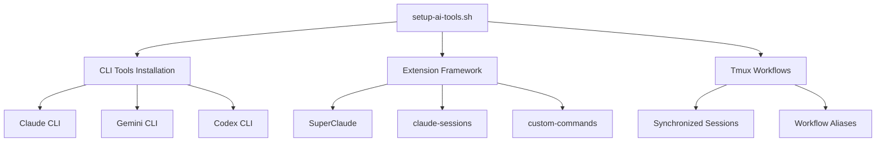
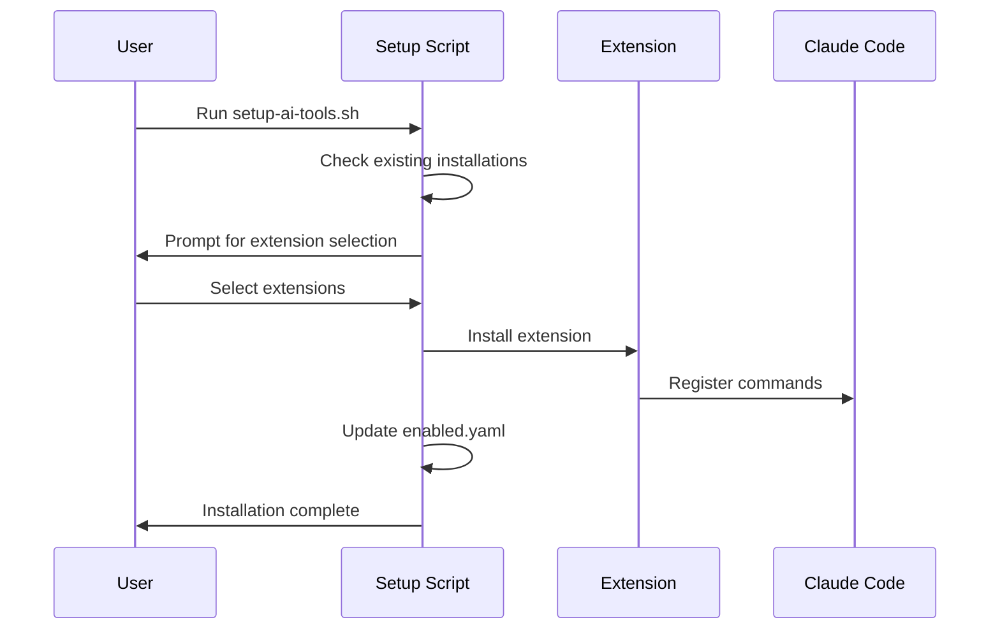

# AI Workflow System Architecture

## Overview

The AI Workflow Tools system provides a comprehensive development environment that integrates multiple AI models with specialized command extensions and synchronized workflow management.

## System Components

### 1. Core Infrastructure



### 2. Extension System Architecture

The extension framework uses a modular design with the following components:

#### Configuration Management
- `config/extensions.yaml` - Extension registry and metadata
- `config/enabled.yaml` - User's active extensions
- Automatic YAML validation and corruption prevention

#### Extension Types
1. **Git Submodules** - External repositories (SuperClaude, claude-sessions)
2. **Local Extensions** - Project-specific commands (custom-commands)
3. **Future Extensions** - Easily pluggable third-party extensions

#### Installation Flow


## Extension Framework Details

### Extension Registry Schema

```yaml
extensions:
  extension-name:
    repo: "repository-url"
    description: "Human-readable description"
    installer: "install-script-name"
    commands: number-of-commands
    categories: ["category1", "category2"]
```

### Detection System

Each extension has specific detection criteria:

- **SuperClaude**: Checks for `CLAUDE.md`, `build.md`, `review.md`, `shared/` directory
- **claude-sessions**: Checks for session command files and sessions directory
- **custom-commands**: Checks for specific workflow command files

### Installation Functions

```bash
is_[extension]_installed()    # Detection logic
install_[extension]()         # Installation logic
add_to_enabled_yaml()         # Configuration management
rebuild_enabled_yaml()        # Corruption recovery
```

## Command Integration

### Claude Code Integration

Commands are integrated into Claude Code through:

1. **Command Files**: Markdown files in `~/.claude/commands/`
2. **Shared Resources**: YAML templates in `~/.claude/shared/`
3. **Configuration**: Main configuration in `~/.claude/CLAUDE.md`

### Command Categories

#### Professional Development (SuperClaude)
- Build automation and deployment
- Code review and analysis
- Testing and quality assurance
- Project management and documentation

#### Session Management (claude-sessions)
- Development session tracking
- Progress documentation
- Context preservation
- Knowledge transfer

#### Workflow Tools (custom-commands)
- Large codebase analysis with Gemini
- Git worktree management
- Parallel development workflows
- Visualization and documentation

## Multi-AI Workflow System

### Tmux Integration

The system provides synchronized multi-AI sessions through tmux:

```
┌─────────────────────────────────────────────────────────────┐
│ tmux session: ai                                            │
├─────────────────┬─────────────────┬─────────────────────────┤
│ Claude CLI      │ Gemini CLI      │ Terminal                │
│ Enhanced with   │ Large context   │ System commands         │
│ extensions      │ analysis        │ Git operations          │
└─────────────────┴─────────────────┴─────────────────────────┘
```

### Workflow Patterns

1. **Analysis → Implementation**: Use Gemini for codebase analysis, Claude for implementation
2. **Parallel Consultation**: Ask same question to multiple AIs simultaneously
3. **Specialized Tasks**: Route specific tasks to most capable AI
4. **Session Tracking**: Document decisions and reasoning throughout development

## Data Flow

### Extension Installation
```
User Request → Setup Script → Extension Detection → Installation → Configuration Update → Validation
```

### Command Execution
```
User Command → Claude Code → Extension Command → AI Processing → Output → Session Tracking
```

### Workflow Management
```
Start Session → Track Progress → Multi-AI Consultation → Decision Documentation → Session End
```

## Security Considerations

### API Key Management
- Environment variable storage
- No hardcoded credentials
- Shell-specific configuration
- Verification and validation

### Extension Security
- Git submodule verification
- Installer script validation
- No automatic execution of untrusted code
- User confirmation for installations

### Session Privacy
- Optional .gitignore configuration for sessions
- Local storage of session data
- No automatic cloud synchronization

## Scalability Features

### Adding New Extensions
1. Create extension repository with commands
2. Add entry to `extensions.yaml`
3. Implement detection and installation functions
4. Test with setup script

### Extension Development Guidelines
- Use `.md` format for Claude Code commands
- Provide clear installation instructions
- Include dependency documentation
- Follow consistent naming conventions

### Maintenance Procedures
- Regular submodule updates
- Extension compatibility verification
- Configuration validation
- User migration support

## Performance Optimization

### Installation Efficiency
- Parallel detection of existing installations
- Conditional installation based on user selection
- YAML optimization and deduplication
- Minimal file system operations

### Runtime Performance
- Lazy loading of extensions
- Efficient command routing
- Minimal overhead for unused extensions
- Optimized tmux session management

## Future Enhancements

### Planned Features
- Extension marketplace integration
- Automatic extension updates
- Cloud synchronization options
- Cross-platform compatibility improvements

### Architecture Evolution
- Plugin system for non-Claude AI integration
- REST API for external tool integration
- Web interface for configuration management
- Enterprise deployment support

## Troubleshooting Architecture

### Self-Healing Features
- Automatic YAML corruption recovery
- Extension reinstallation capabilities
- Configuration validation and repair
- Session state recovery

### Diagnostic Tools
- Installation status verification
- Extension health checks
- Configuration validation
- Performance monitoring

This architecture provides a robust, scalable foundation for multi-AI development workflows while maintaining simplicity and ease of use.